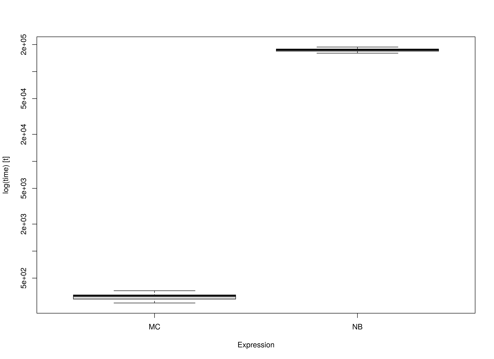

We compare the Monte Carlo (MC) method with nonparametric bootstrapping (NB) using the simple mediation model with missing data.
One advantage of MC over NB is speed.
This is because the model is only fitted once in MC whereas it is fitted many times in NB.


```r
library(semmcci)
library(lavaan)
library(microbenchmark)
```

## Data


```r
n <- 1000
a <- 0.50
b <- 0.50
cp <- 0.25
s2_em <- 1 - a^2
s2_ey <- 1 - cp^2 - a^2 * b^2 - b^2 * s2_em - 2 * cp * a * b
em <- rnorm(n = n, mean = 0, sd = sqrt(s2_em))
ey <- rnorm(n = n, mean = 0, sd = sqrt(s2_ey))
X <- rnorm(n = n)
M <- a * X + em
Y <- cp * X + b * M + ey
df <- data.frame(X, M, Y)

# Create data set with missing values.

miss <- sample(1:dim(df)[1], 300)
df[miss[1:100], "X"] <- NA
df[miss[101:200], "M"] <- NA
df[miss[201:300], "Y"] <- NA
```

## Model Specification

The indirect effect is defined by the product of the slopes
of paths `X` to `M` labeled as `a` and `M` to `Y` labeled as `b`.
In this example, we are interested in the confidence intervals of `indirect`
defined as the product of `a` and `b` using the `:=` operator
in the `lavaan` model syntax.


```r
model <- "
  Y ~ cp * X + b * M
  M ~ a * X
  indirect := a * b
  direct := cp
  total := cp + (a * b)
"
```

## Model Fitting

We can now fit the model using the `sem()` function from `lavaan`.
We are using `missing = "fiml"` to handle missing data in `lavaan`.
Since there are missing values in `x`, we also set `fixed.x = FALSE`.


```r
fit <- sem(data = df, model = model, missing = "fiml", fixed.x = FALSE)
```

## Monte Carlo Confidence Intervals

The `fit` `lavaan` object can then be passed to the `MC()` function from `semmcci`
to generate Monte Carlo confidence intervals.


```r
MC(fit, R = 5000L, alpha = c(0.001, 0.01, 0.05))
#> Monte Carlo Confidence Intervals
#>              est     se    R   0.05%    0.5%    2.5%  97.5%  99.5% 99.95%
#> cp        0.2335 0.0293 5000  0.1364  0.1556  0.1760 0.2903 0.3114 0.3287
#> b         0.5112 0.0295 5000  0.4156  0.4376  0.4541 0.5682 0.5861 0.6089
#> a         0.4809 0.0285 5000  0.3823  0.4082  0.4248 0.5375 0.5537 0.5783
#> Y~~Y      0.5542 0.0269 5000  0.4626  0.4830  0.5014 0.6068 0.6236 0.6395
#> M~~M      0.7564 0.0363 5000  0.6417  0.6656  0.6840 0.8262 0.8502 0.8761
#> X~~X      1.0591 0.0495 5000  0.8963  0.9350  0.9601 1.1541 1.1792 1.2153
#> Y~1      -0.0127 0.0258 5000 -0.1000 -0.0830 -0.0630 0.0373 0.0557 0.0674
#> M~1      -0.0223 0.0292 5000 -0.1129 -0.0965 -0.0792 0.0343 0.0577 0.0715
#> X~1       0.0025 0.0336 5000 -0.1050 -0.0874 -0.0652 0.0658 0.0875 0.1119
#> indirect  0.2458 0.0200 5000  0.1819  0.1970  0.2078 0.2861 0.2985 0.3168
#> direct    0.2335 0.0293 5000  0.1364  0.1556  0.1760 0.2903 0.3114 0.3287
#> total     0.4794 0.0286 5000  0.3734  0.4048  0.4236 0.5342 0.5525 0.5761
```

## Nonparametric Bootstrap Confidence Intervals

Nonparametric bootstrap confidence intervals can be generated in `lavaan` using the following.


```r
parameterEstimates(
  sem(
    data = df,
    model = model,
    missing = "fiml",
    fixed.x = FALSE,
    se = "bootstrap",
    bootstrap = 5000L
  )
)
#>         lhs op      rhs    label    est    se      z pvalue ci.lower ci.upper
#> 1         Y  ~        X       cp  0.234 0.030  7.805  0.000    0.176    0.293
#> 2         Y  ~        M        b  0.511 0.030 16.832  0.000    0.452    0.572
#> 3         M  ~        X        a  0.481 0.029 16.770  0.000    0.426    0.538
#> 4         Y ~~        Y           0.554 0.027 20.203  0.000    0.500    0.607
#> 5         M ~~        M           0.756 0.037 20.398  0.000    0.684    0.828
#> 6         X ~~        X           1.059 0.051 20.619  0.000    0.956    1.157
#> 7         Y ~1                   -0.013 0.025 -0.508  0.611   -0.061    0.037
#> 8         M ~1                   -0.022 0.028 -0.786  0.432   -0.078    0.034
#> 9         X ~1                    0.002 0.034  0.074  0.941   -0.065    0.072
#> 10 indirect :=      a*b indirect  0.246 0.020 12.060  0.000    0.207    0.288
#> 11   direct :=       cp   direct  0.234 0.030  7.804  0.000    0.176    0.293
#> 12    total := cp+(a*b)    total  0.479 0.029 16.480  0.000    0.422    0.536
```

## Benchmark

### Arguments


|Variables |Values |Notes                               |
|:---------|:------|:-----------------------------------|
|R         |5000   |Number of Monte Carlo replications. |
|B         |5000   |Number of bootstrap samples.        |


```r
benchmark01 <- microbenchmark(
  MC = {
    fit <- sem(
      data = df,
      model = model,
      missing = "fiml",
      fixed.x = FALSE
    )
    MC(
      fit,
      R = R,
      decomposition = "chol",
      pd = FALSE
    )
  },
  NB = sem(
    data = df,
    model = model,
    missing = "fiml",
    fixed.x = FALSE,
    se = "bootstrap",
    bootstrap = B
  ),
  times = 10
)
```

### Summary of Benchmark Results


```r
summary(benchmark01, unit = "ms")
#>   expr        min          lq        mean      median          uq         max
#> 1   MC    173.833    205.2419    227.2141    222.5822    250.5154    274.4581
#> 2   NB 110619.112 111489.4273 112113.8404 111927.0876 113015.0124 113919.6178
#>   neval cld
#> 1    10  a 
#> 2    10   b
```

### Summary of Benchmark Results Relative to the Faster Method


```r
summary(benchmark01, unit = "relative")
#>   expr      min       lq     mean   median       uq     max neval cld
#> 1   MC   1.0000   1.0000   1.0000   1.0000   1.0000   1.000    10  a 
#> 2   NB 636.3527 543.2098 493.4282 502.8573 451.1301 415.071    10   b
```

### Plot



## Benchmark - Monte Carlo Method with Precalculated Estimates


```r
fit <- sem(
  data = df,
  model = model,
  missing = "fiml",
  fixed.x = FALSE
)
benchmark02 <- microbenchmark(
  MC = MC(
    fit,
    R = R,
    decomposition = "chol",
    pd = FALSE
  ),
  NB = sem(
    data = df,
    model = model,
    missing = "fiml",
    fixed.x = FALSE,
    se = "bootstrap",
    bootstrap = B
  ),
  times = 10
)
```

### Summary of Benchmark Results


```r
summary(benchmark02, unit = "ms")
#>   expr         min          lq        mean      median          uq         max
#> 1   MC    118.1595    121.2965    123.1068    122.9263    125.7505    129.4889
#> 2   NB 110678.8702 111070.3404 112020.7645 112106.5329 113007.7071 113404.1493
#>   neval cld
#> 1    10  a 
#> 2    10   b
```

### Summary of Benchmark Results Relative to the Faster Method


```r
summary(benchmark02, unit = "relative")
#>   expr      min       lq     mean   median      uq      max neval cld
#> 1   MC   1.0000   1.0000   1.0000   1.0000   1.000   1.0000    10  a 
#> 2   NB 936.6905 915.6931 909.9477 911.9814 898.666 875.7829    10   b
```

### Plot


