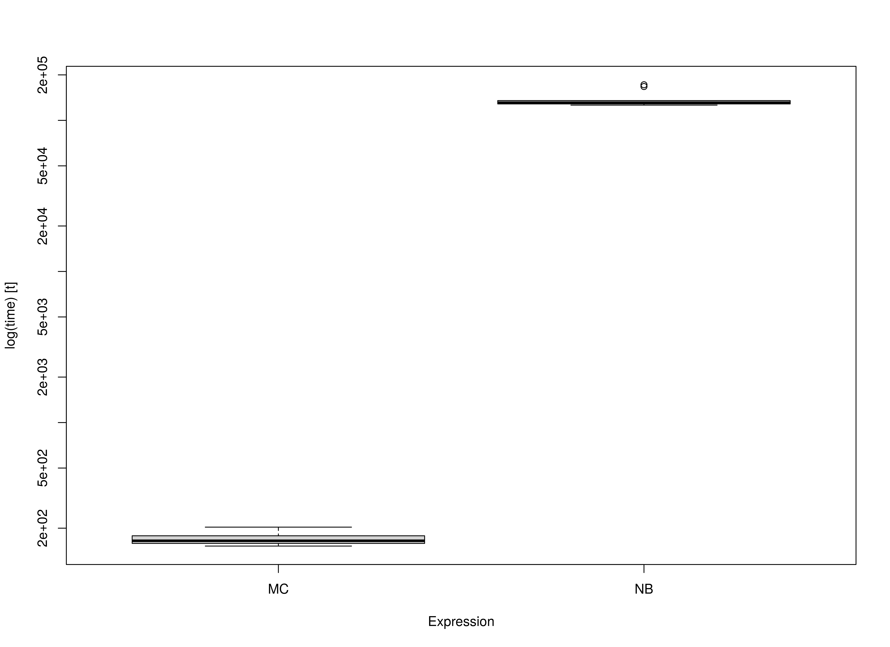

We compare the Monte Carlo (MC) method with nonparametric bootstrapping (NB) using the simple mediation model with missing data.
One advantage of MC over NB is speed.
This is because the model is only fitted once in MC whereas it is fitted many times in NB.


```r
library(semmcci)
library(lavaan)
library(microbenchmark)
```

## Data


```r
n <- 1000
a <- 0.50
b <- 0.50
cp <- 0.25
s2_em <- 1 - a^2
s2_ey <- 1 - cp^2 - a^2 * b^2 - b^2 * s2_em - 2 * cp * a * b
em <- rnorm(n = n, mean = 0, sd = sqrt(s2_em))
ey <- rnorm(n = n, mean = 0, sd = sqrt(s2_ey))
X <- rnorm(n = n)
M <- a * X + em
Y <- cp * X + b * M + ey
df <- data.frame(X, M, Y)

# Create data set with missing values.

miss <- sample(1:dim(df)[1], 300)
df[miss[1:100], "X"] <- NA
df[miss[101:200], "M"] <- NA
df[miss[201:300], "Y"] <- NA
```

## Model Specification

The indirect effect is defined by the product of the slopes
of paths `X` to `M` labeled as `a` and `M` to `Y` labeled as `b`.
In this example, we are interested in the confidence intervals of `indirect`
defined as the product of `a` and `b` using the `:=` operator
in the `lavaan` model syntax.


```r
model <- "
  Y ~ cp * X + b * M
  M ~ a * X
  indirect := a * b
  direct := cp
  total := cp + (a * b)
"
```

## Model Fitting

We can now fit the model using the `sem()` function from `lavaan`.
We are using `missing = "fiml"` to handle missing data in `lavaan`.
Since there are missing values in `x`, we also set `fixed.x = FALSE`.


```r
fit <- sem(data = df, model = model, missing = "fiml", fixed.x = FALSE)
```

## Monte Carlo Confidence Intervals

The `fit` `lavaan` object can then be passed to the `MC()` function from `semmcci`
to generate Monte Carlo confidence intervals.


```r
MC(fit, R = 5000L, alpha = c(0.001, 0.01, 0.05))
#> Monte Carlo Confidence Intervals
#>              est     se    R   0.05%    0.5%    2.5%  97.5%  99.5% 99.95%
#> cp        0.2335 0.0299 5000  0.1352  0.1532  0.1744 0.2924 0.3086 0.3321
#> b         0.5112 0.0300 5000  0.4041  0.4315  0.4520 0.5696 0.5897 0.6120
#> a         0.4809 0.0290 5000  0.3740  0.4063  0.4233 0.5369 0.5553 0.5790
#> Y~~Y      0.5542 0.0271 5000  0.4656  0.4820  0.5020 0.6073 0.6242 0.6445
#> M~~M      0.7564 0.0359 5000  0.6367  0.6641  0.6876 0.8270 0.8478 0.8664
#> X~~X      1.0591 0.0499 5000  0.8995  0.9322  0.9615 1.1563 1.1837 1.2135
#> Y~1      -0.0127 0.0252 5000 -0.0935 -0.0795 -0.0605 0.0371 0.0529 0.0661
#> M~1      -0.0223 0.0294 5000 -0.1157 -0.0999 -0.0790 0.0347 0.0500 0.0680
#> X~1       0.0025 0.0338 5000 -0.1118 -0.0859 -0.0636 0.0674 0.0868 0.1068
#> indirect  0.2458 0.0205 5000  0.1839  0.1973  0.2068 0.2877 0.3003 0.3155
#> direct    0.2335 0.0299 5000  0.1352  0.1532  0.1744 0.2924 0.3086 0.3321
#> total     0.4794 0.0285 5000  0.3820  0.4054  0.4239 0.5351 0.5506 0.5698
```

## Nonparametric Bootstrap Confidence Intervals

Nonparametric bootstrap confidence intervals can be generated in `lavaan` using the following.


```r
parameterEstimates(
  sem(
    data = df,
    model = model,
    missing = "fiml",
    fixed.x = FALSE,
    se = "bootstrap",
    bootstrap = 5000L
  )
)
#>         lhs op      rhs    label    est    se      z pvalue ci.lower ci.upper
#> 1         Y  ~        X       cp  0.234 0.030  7.891  0.000    0.175    0.291
#> 2         Y  ~        M        b  0.511 0.031 16.657  0.000    0.450    0.572
#> 3         M  ~        X        a  0.481 0.029 16.755  0.000    0.426    0.538
#> 4         Y ~~        Y           0.554 0.027 20.256  0.000    0.499    0.606
#> 5         M ~~        M           0.756 0.036 20.731  0.000    0.685    0.829
#> 6         X ~~        X           1.059 0.052 20.559  0.000    0.963    1.163
#> 7         Y ~1                   -0.013 0.025 -0.507  0.612   -0.063    0.037
#> 8         M ~1                   -0.022 0.029 -0.772  0.440   -0.078    0.035
#> 9         X ~1                    0.002 0.034  0.074  0.941   -0.066    0.067
#> 10 indirect :=      a*b indirect  0.246 0.020 12.173  0.000    0.209    0.287
#> 11   direct :=       cp   direct  0.234 0.030  7.890  0.000    0.175    0.291
#> 12    total := cp+(a*b)    total  0.479 0.029 16.642  0.000    0.424    0.538
```

## Benchmark

### Arguments


|Variables |Values |Notes                               |
|:---------|:------|:-----------------------------------|
|R         |5000   |Number of Monte Carlo replications. |
|B         |5000   |Number of bootstrap samples.        |


```r
benchmark01 <- microbenchmark(
  MC = {
    fit <- sem(
      data = df,
      model = model,
      missing = "fiml",
      fixed.x = FALSE
    )
    MC(
      fit,
      R = R,
      decomposition = "chol",
      pd = FALSE
    )
  },
  NB = sem(
    data = df,
    model = model,
    missing = "fiml",
    fixed.x = FALSE,
    se = "bootstrap",
    bootstrap = B
  ),
  times = 10
)
```

### Summary of Benchmark Results


```r
summary(benchmark01, unit = "ms")
#>   expr         min          lq        mean      median          uq         max
#> 1   MC    135.1449    136.8319    140.3026    139.3056    140.8353    155.7571
#> 2   NB 105114.7166 105172.6348 106346.5907 105496.2655 108452.1265 108853.1083
#>   neval cld
#> 1    10  a 
#> 2    10   b
```

### Summary of Benchmark Results Relative to the Faster Method


```r
summary(benchmark01, unit = "relative")
#>   expr      min       lq     mean  median       uq      max neval cld
#> 1   MC   1.0000   1.0000   1.0000   1.000   1.0000   1.0000    10  a 
#> 2   NB 777.7927 768.6265 757.9803 757.301 770.0636 698.8645    10   b
```

### Plot


## Benchmark - Monte Carlo Method with Precalculated Estimates


```r
fit <- sem(
  data = df,
  model = model,
  missing = "fiml",
  fixed.x = FALSE
)
benchmark02 <- microbenchmark(
  MC = MC(
    fit,
    R = R,
    decomposition = "chol",
    pd = FALSE
  ),
  NB = sem(
    data = df,
    model = model,
    missing = "fiml",
    fixed.x = FALSE,
    se = "bootstrap",
    bootstrap = B
  ),
  times = 10
)
```

### Summary of Benchmark Results


```r
summary(benchmark02, unit = "ms")
#>   expr          min           lq         mean       median           uq
#> 1   MC     72.71116     73.53584     74.96549     74.49149     76.32775
#> 2   NB 104236.14383 104885.66404 105098.29133 105241.16274 105390.96774
#>            max neval cld
#> 1     78.03543    10  a 
#> 2 105618.93375    10   b
```

### Summary of Benchmark Results Relative to the Faster Method


```r
summary(benchmark02, unit = "relative")
#>   expr      min      lq     mean   median       uq      max neval cld
#> 1   MC    1.000    1.00    1.000    1.000    1.000    1.000    10  a 
#> 2   NB 1433.565 1426.32 1401.956 1412.794 1380.769 1353.474    10   b
```

### Plot


