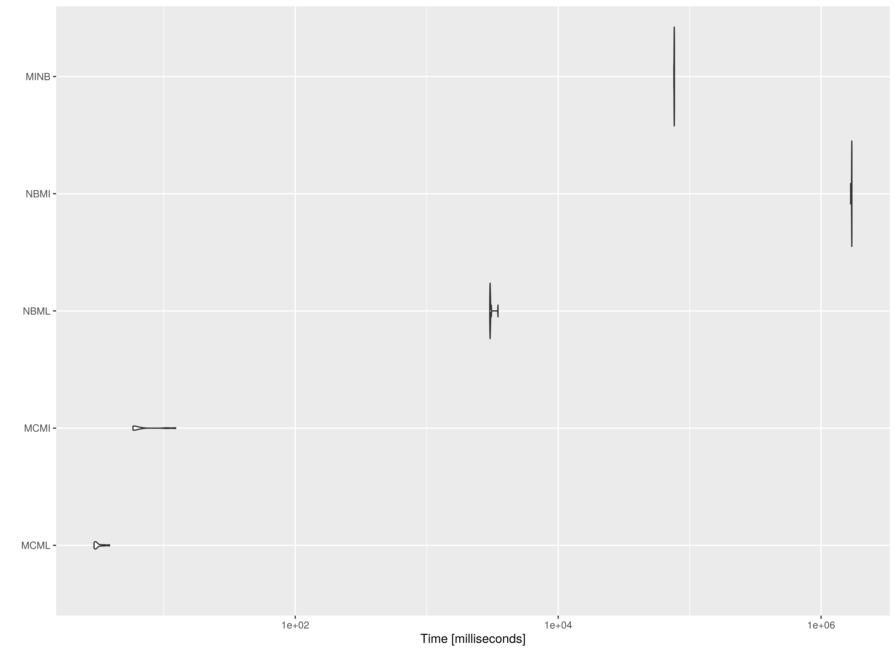
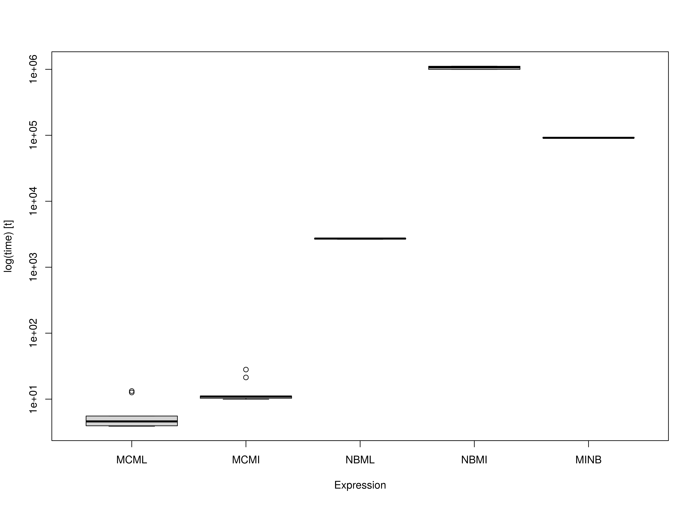

The following is a simple benchmark comparing the computational requirements of the methods to generate confidence intervals for the indirect effect with missing observations. We will use the generated data in the [Data Generation](data-generation.html) article.

In this benchmark, we compare the following methods

- Monte Carlo method using full-information maximum likelihood (`MCML()`), 
- Monte Carlo method using multiple imputation (`MCMI()`),
- full-information maximum likelihood nested within nonparametric bootstrap (`NBML()`),
- multiple imputation nested within nonparametric bootstrap (`NBMI()`)
- nonparametric bootstrap nested within multiple imputation (`MINB()`)

## Arguments


```r
library(manMCMedMiss)
library(microbenchmark)
```


|Variables |Values                  |Notes                               |
|:---------|:-----------------------|:-----------------------------------|
|m         |100                     |Number of imputations.              |
|R         |5000                    |Number of Monte Carlo replications. |
|B         |5000                    |Number of bootstrap samples.        |
|mplus_bin |"/opt/mplusdemo/mpdemo" |Path to Mplus binary.               |


> **NOTE**: If you are using `manmcmedmiss-rocker` or `manmcmedmiss.sif` described in the [Containers](containers.html) article, set `mplus_bin = "mpdemo"`.


## Benchmark

## Parameters


|Variable |Value             |Notes           |
|:--------|:-----------------|:---------------|
|n        |50                |$n$             |
|tauprime |0.14142135623731  |$\tau^{\prime}$ |
|alpha    |0.714074191775111 |$\alpha$        |
|beta     |0.714074191775111 |$\beta$         |


## Data

### Generation

Generate sample data with complete observations.


```r
set.seed(42)
data_complete <- GenData(
  n = n,
  tauprime = tauprime,
  beta = beta,
  alpha = alpha
)
```

### Amputation

Generate sample data with missing values using the multivariate amputation approach proposed by Schouten et al. (2018).


```r
data_missing <- AmputeData(
  data_complete,
  mech = "MAR",
  prop = 0.10
)
```

### Imputation

Perform multiple imputation following Asparouhov and Muthen (2010) using `Mplus`.


```r
data_mi <- ImputeData(
  data_missing,
  m = m,
  mplus_bin = mplus_bin
)
```

## Maximum Likelihood

### Missing Data

Parameters of the simple mediation model are estimated using full-information maximum likelihood to handle missing data.


```r
fit_ml <- FitModelML(
  data_missing,
  mplus_bin = mplus_bin
)
```

## Multiple Imputation

Parameters of the simple mediation model are estimated using maximum likelihood for each of the imputed data sets. The parameter estimates and their sampling covariance matrix are pooled.


```r
fit_mi <- FitModelMI(
  data_mi,
  mplus_bin = mplus_bin
)
```

## Benchmark


```r
benchmark <- microbenchmark(
  MCML = MCML(
    fit_ml,
    R = R
  ),
  MCMI = MCMI(
    fit_mi,
    R = R
  ),
  NBML = NBML(
    data_missing,
    B = B,
    mplus_bin = mplus_bin
  ),
  NBMI = NBMI(
    data_missing,
    data_mi,
    B = B,
    m = m,
    mplus_bin = mplus_bin
  ),
  MINB = MINB(
    data_mi,
    B = B
  ),
  times = 10
)
```

## Summary of Benchmark Results


```r
summary(benchmark, unit = "ms")
#>   expr          min           lq         mean       median           uq
#> 1 MCML     18.73027     34.62104     48.37869     46.02422 5.337519e+01
#> 2 MCMI     32.08413     34.56102     68.64550     61.40423 1.054957e+02
#> 3 NBML   1779.85401   1995.39254   2686.87359   2700.63207 3.396238e+03
#> 4 NBMI 626443.36697 787734.54704 907889.17563 818272.44441 1.090418e+06
#> 5 MINB  43613.55303  46511.95203  60975.13838  48293.08648 8.038919e+04
#>            max neval cld
#> 1     101.9532    10  a 
#> 2     123.1622    10  a 
#> 3    3541.1389    10  a 
#> 4 1263013.0070    10   b
#> 5   92118.3821    10  a
```

## Summary of Benchmark Results Relative to the Fastest Method


```r
summary(benchmark, unit = "relative")
#>   expr          min           lq        mean       median           uq
#> 1 MCML     1.000000 1.000000e+00     1.00000     1.000000     1.000000
#> 2 MCMI     1.712956 9.982665e-01     1.41892     1.334172     1.976494
#> 3 NBML    95.025549 5.763526e+01    55.53837    58.678492    63.629527
#> 4 NBMI 33445.510068 2.275306e+04 18766.30431 17779.168542 20429.300198
#> 5 MINB  2328.506620 1.343459e+03  1260.37190  1049.297126  1506.115228
#>            max neval cld
#> 1     1.000000    10  a 
#> 2     1.208027    10  a 
#> 3    34.732974    10  a 
#> 4 12388.160554    10   b
#> 5   903.535673    10  a
```

## Plot



The `MC` approaches are faster compared to their `NB` counterparts. Note the increasing model complexity will increase the computational cost of `NB`. However, for `MC`, model complexity will not increase the computational cost of the simulation stage. For example, `MI` estimates are more computationally intensive than `ML` estimates. This results in a large difference between `NBML` and the two `NB` methods using `MI`, that is, `NBMI` and `MINB`. Note that `MINB` is faster than `NBMI` as expected but it is still significantly slower than the `MC` approaches.

However, if we perform the model fitting step outside the benchmark calculation, the speed of `MCML` and `MCMI` will be virtually identical. In this implementation, however, `MCMI` will be a little bit slower than `MCML` because it generates two sets of confidence intervals (`vcov` and `vcov_tilde`) while `MCML` generates a single set. Since `MC` relies on a single estimate of the parameters and the sampling covariance matrix, it is suited for more complex models.

> **NOTE**: Note that since `NB` only needs point estimates, a closed form solution of the indirect effect is used in `NBMI` and `MINB`. When optimization is used to estimate parameters in the context of structural equation modeling, `NBMI` and `MINB` will be significantly slower.
