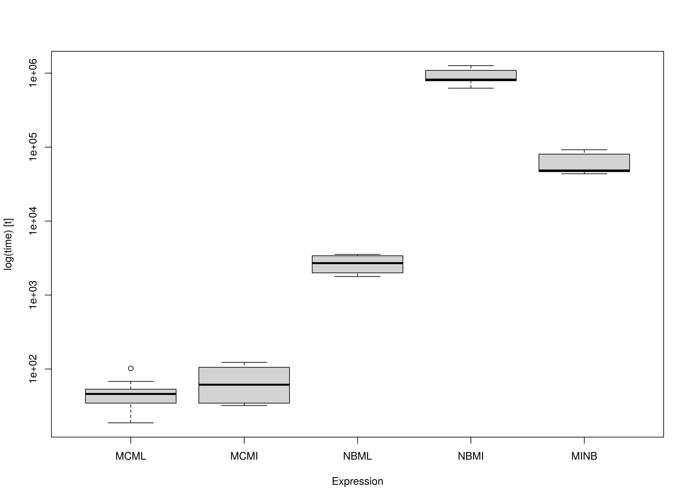

The following is a simple benchmark comparing the computational requirements of the methods to generate confidence intervals for the indirect effect with missing observations. We will use the generated data in the [Data Generation](data-generation.html) article.

In this benchmark, we compare the following methods

- Monte Carlo method using full-information maximum likelihood (`MCML()`), 
- Monte Carlo method using multiple imputation (`MCMI()`),
- full-information maximum likelihood nested within nonparametric bootstrap (`NBML()`),
- multiple imputation nested within nonparametric bootstrap (`NBMI()`)
- nonparametric bootstrap nested within multiple imputation (`MINB()`)

## Arguments


```r
library(manMCMedMiss)
library(microbenchmark)
```


|Variables |Values                  |Notes                               |
|:---------|:-----------------------|:-----------------------------------|
|m         |100                     |Number of imputations.              |
|R         |5000                    |Number of Monte Carlo replications. |
|B         |5000                    |Number of bootstrap samples.        |
|mplus_bin |"/opt/mplusdemo/mpdemo" |Path to Mplus binary.               |

> **NOTE**: If you are using `manmcmedmiss-rocker` or `manmcmedmiss.sif` described in the [Containers](containers.html) article, set `mplus_bin = "mpdemo"`.


## Benchmark

## Parameters


|Variable |Value             |Notes           |
|:--------|:-----------------|:---------------|
|n        |50                |$n$             |
|tauprime |0.14142135623731  |$\tau^{\prime}$ |
|alpha    |0.714074191775111 |$\alpha$        |
|beta     |0.714074191775111 |$\beta$         |

## Data

### Generation

Generate sample data with complete observations.


```r
set.seed(42)
data_complete <- GenData(
  n = n,
  tauprime = tauprime,
  beta = beta,
  alpha = alpha
)
```

### Amputation

Generate sample data with missing values using the multivariate amputation approach proposed by Schouten et al. (2018).


```r
data_missing <- AmputeData(
  data_complete,
  mech = "MAR",
  prop = 0.10
)
```

### Imputation

Perform multiple imputation following Asparouhov and Muthen (2010) using `Mplus`.


```r
data_mi <- ImputeData(
  data_missing,
  m = m,
  mplus_bin = mplus_bin
)
```

## Maximum Likelihood

### Missing Data

Parameters of the simple mediation model are estimated using full-information maximum likelihood to handle missing data.


```r
fit_ml <- FitModelML(
  data_missing,
  mplus_bin = mplus_bin
)
```

## Multiple Imputation

Parameters of the simple mediation model are estimated using maximum likelihood for each of the imputed data sets. The parameter estimates and their sampling covariance matrix are pooled.


```r
fit_mi <- FitModelMI(
  data_mi,
  mplus_bin = mplus_bin
)
```

## Benchmark


```r
benchmark <- microbenchmark(
  MCML = MCML(
    fit_ml,
    R = R
  ),
  MCMI = MCMI(
    fit_mi,
    R = R
  ),
  NBML = NBML(
    data_missing,
    B = B,
    mplus_bin = mplus_bin
  ),
  NBMI = NBMI(
    data_missing,
    data_mi,
    B = B,
    m = m,
    mplus_bin = mplus_bin
  ),
  MINB = MINB(
    data_mi,
    B = B
  ),
  times = 10
)
```

## Summary of Benchmark Results


```r
summary(benchmark, unit = "ms")
#>   expr          min           lq         mean       median           uq
#> 1 MCML 2.946436e+00 3.028264e+00 3.296083e+00 3.062665e+00 3.537510e+00
#> 2 MCMI 5.844165e+00 6.449236e+00 7.771129e+00 6.669448e+00 1.006536e+01
#> 3 NBML 3.034296e+03 3.040779e+03 3.059865e+03 3.055097e+03 3.081949e+03
#> 4 NBMI 1.742479e+06 1.749828e+06 1.750708e+06 1.750331e+06 1.753822e+06
#> 5 MINB 7.596024e+04 7.640213e+04 7.656028e+04 7.666521e+04 7.682440e+04
#>            max neval  cld
#> 1 4.581331e+00    10 a   
#> 2 1.128697e+01    10 a   
#> 3 3.095193e+03    10  b  
#> 4 1.759777e+06    10    d
#> 5 7.700837e+04    10   c
```

## Summary of Benchmark Results Relative to the Fastest Method


```r
summary(benchmark, unit = "relative")
#>   expr          min           lq         mean       median           uq
#> 1 MCML 1.000000e+00 1.000000e+00 1.000000e+00 1.000000e+00 1.000000e+00
#> 2 MCMI 1.983469e+00 2.129681e+00 2.357686e+00 2.177662e+00 2.845324e+00
#> 3 NBML 1.029819e+03 1.004133e+03 9.283338e+02 9.975290e+02 8.712198e+02
#> 4 NBMI 5.913853e+05 5.778322e+05 5.311481e+05 5.715058e+05 4.957787e+05
#> 5 MINB 2.578038e+04 2.522968e+04 2.322765e+04 2.503219e+04 2.171708e+04
#>            max neval  cld
#> 1 1.000000e+00    10 a   
#> 2 2.463688e+00    10 a   
#> 3 6.756100e+02    10  b  
#> 4 3.841192e+05    10    d
#> 5 1.680917e+04    10   c
```

## Plot



The `MC` approaches are faster compared to their `NB` counterparts. Note the increasing model complexity will increase the computational cost of `NB`. However, for `MC`, model complexity will not increase the computational cost of the simulation stage. For example, `MI` estimates are more computationally intensive than `ML` estimates. This results in a large difference between `NBML` and the two `NB` methods using `MI`, that is, `NBMI` and `MINB`. Note that `MINB` is faster than `NBMI` as expected but it is still significantly slower than the `MC` approaches.

However, if we perform the model fitting step outside the benchmark calculation, the speed of `MCML` and `MCMI` will be virtually identical. In this implementation, however, `MCMI` will be a little bit slower than `MCML` because it generates two sets of confidence intervals (`vcov` and `vcov_tilde`) while `MCML` generates a single set. Since `MC` relies on a single estimate of the parameters and the sampling covariance matrix, it is suited for more complex models.

> **NOTE**: Note that since `NB` only needs point estimates, a closed form solution of the indirect effect is used in `NBMI` and `MINB`. When optimization is used to estimate parameters in the context of structural equation modeling, `NBMI` and `MINB` will be significantly slower.

## References

Asparouhov, T., & Muthen, B. (2010). *Multiple imputation with Mplus*. Retrieved from http://www.statmodel.com/download/Imputations7.pdf

Schouten, R. M., Lugtig, P. and Vink, G. (2018). Generating missing values for simulation purposes: A multivariate amputation procedure. *Journal of Statistical Computation and Simulation*, *88*(15), 1909--1930. https://doi.org/10.1080/00949655.2018.1491577
