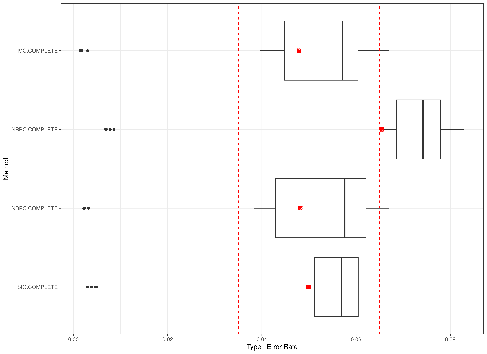
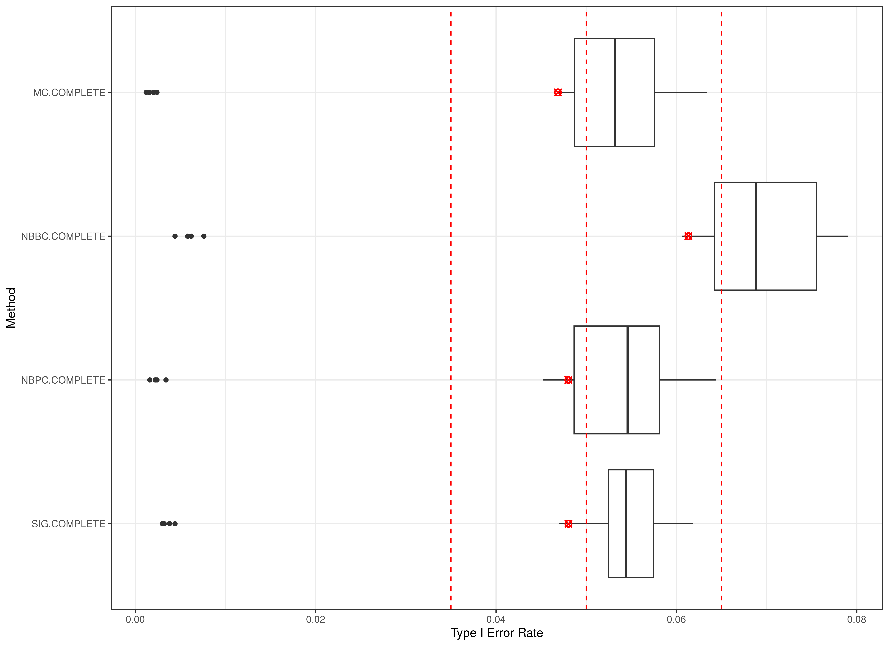
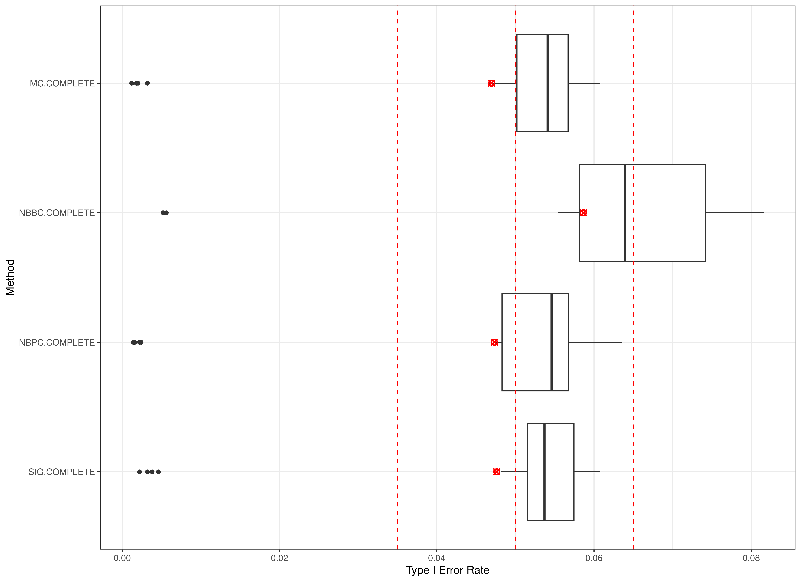
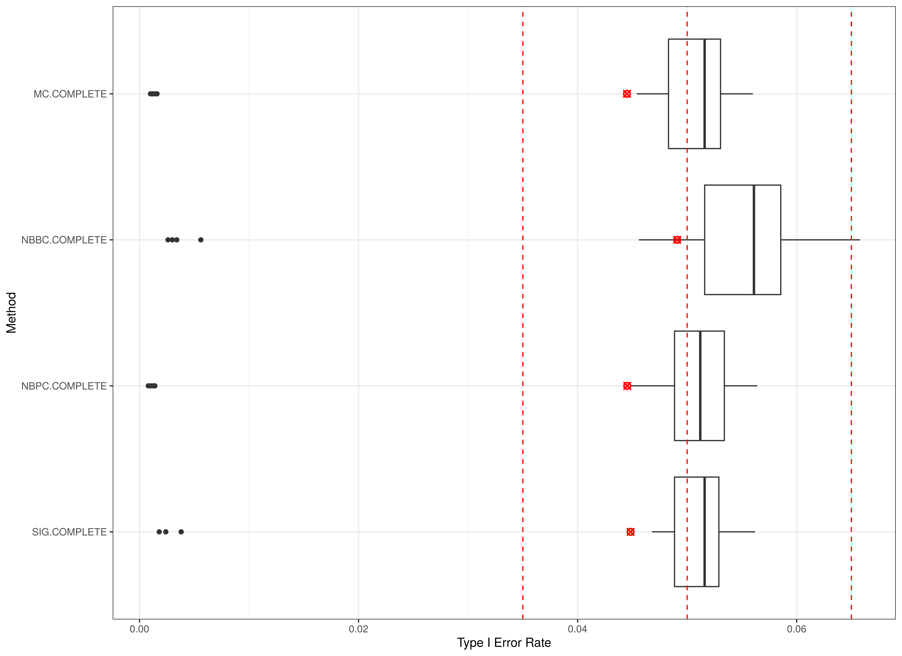
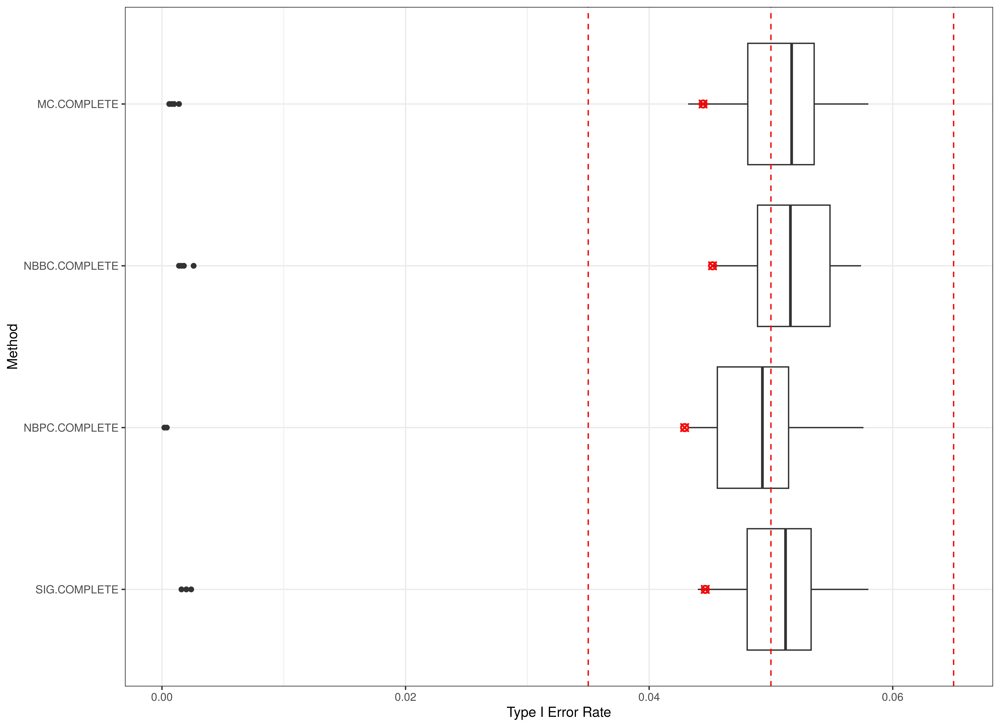
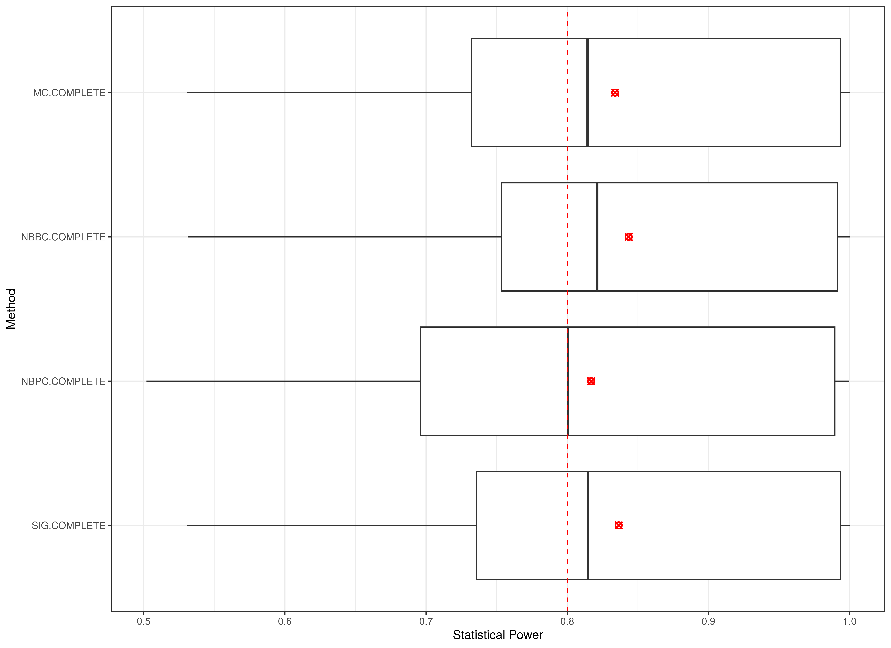
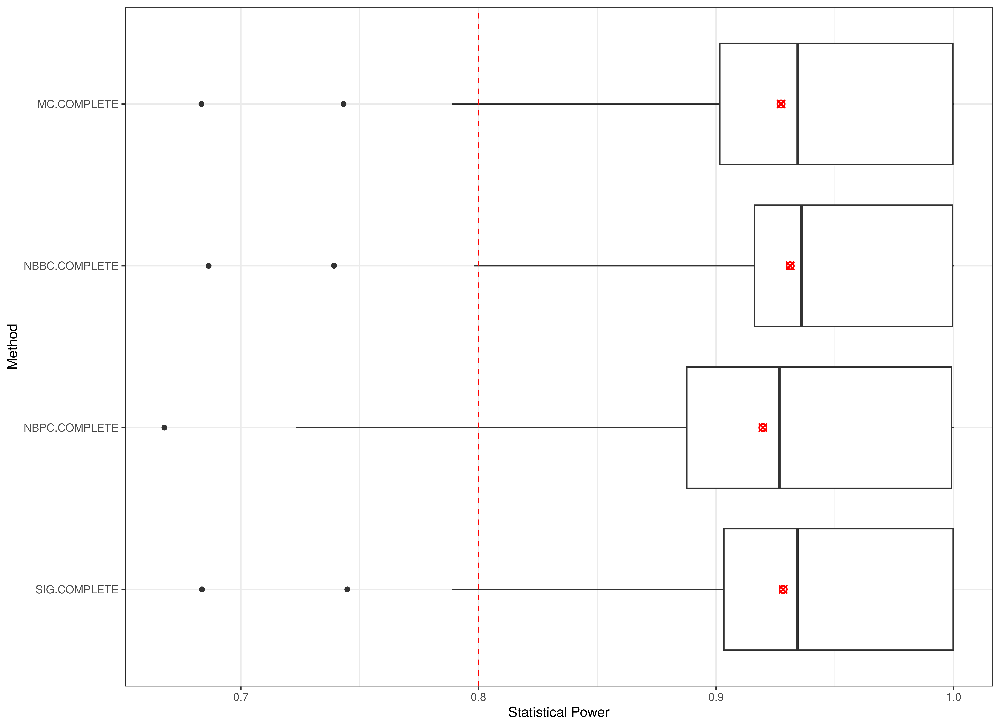
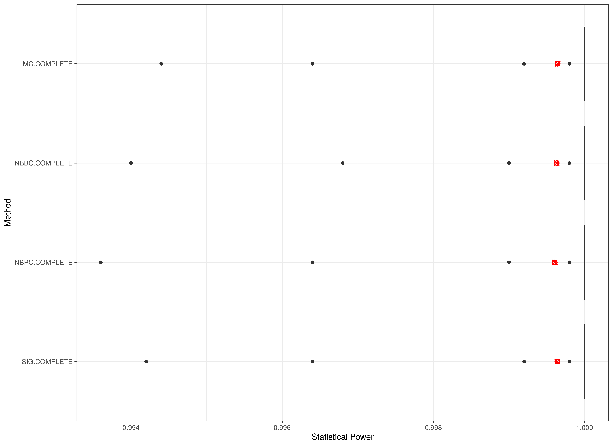
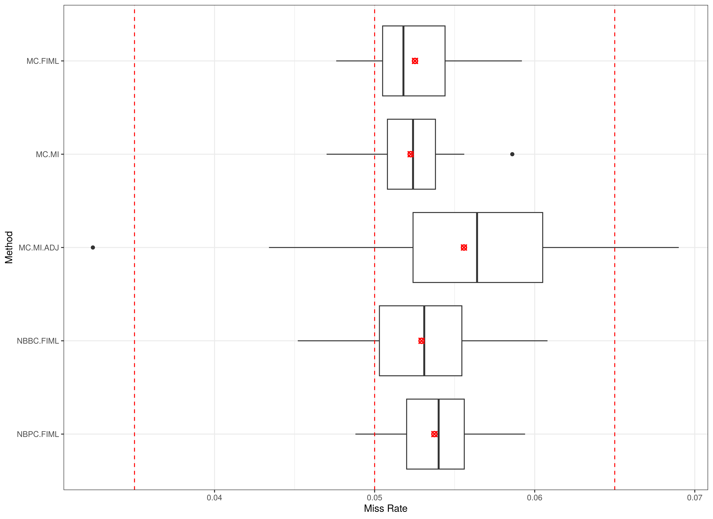
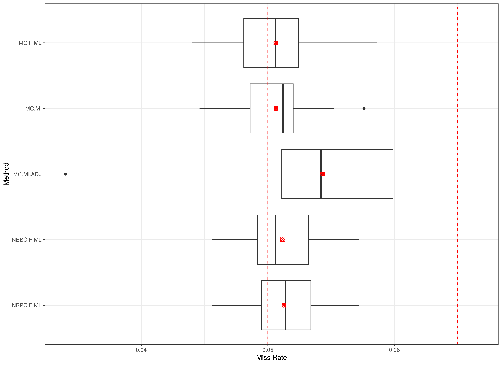

---
title: "Box Plots"
author: "Ivan Jacob Agaloos Pesigan"
output: rmarkdown::html_vignette
vignette: >
  %\VignetteIndexEntry{Box Plots}
  %\VignetteEngine{knitr::rmarkdown}
  %\VignetteEncoding{UTF-8}
---

Presented below are box plots of Type I error rates, statistical power, and miss rates. See `FigBoxPlot()` for more details on the plots below.

## Complete Data

### Type I Error Rate (Mechanism = COMPLETE)

### Type I Error Rate (Mechanism = COMPLETE, n = 50)

  

### Type I Error Rate (Mechanism = COMPLETE, n = 75)

  

### Type I Error Rate (Mechanism = COMPLETE, n = 100)

  

### Type I Error Rate (Mechanism = COMPLETE, n = 150)

  

### Type I Error Rate (Mechanism = COMPLETE, n = 200)

  

### Type I Error Rate (Mechanism = COMPLETE, n = 250)

  

### Type I Error Rate (Mechanism = COMPLETE, n = 500)

  

### Type I Error Rate (Mechanism = COMPLETE, n = 1000)

  

### Statistical Power (Mechanism = COMPLETE)

### Statistical Power (Mechanism = COMPLETE, n = 50)

  

### Statistical Power (Mechanism = COMPLETE, n = 75)

  

### Statistical Power (Mechanism = COMPLETE, n = 100)

  

### Statistical Power (Mechanism = COMPLETE, n = 150)

  

### Statistical Power (Mechanism = COMPLETE, n = 200)

  

### Statistical Power (Mechanism = COMPLETE, n = 250)

  

### Statistical Power (Mechanism = COMPLETE, n = 500)

  

### Statistical Power (Mechanism = COMPLETE, n = 1000)

  

### Miss Rate (Mechanism = COMPLETE)

### Miss Rate (Mechanism = COMPLETE, n = 50)

  

### Miss Rate (Mechanism = COMPLETE, n = 75)

  

### Miss Rate (Mechanism = COMPLETE, n = 100)

  

### Miss Rate (Mechanism = COMPLETE, n = 150)

  

### Miss Rate (Mechanism = COMPLETE, n = 200)

  

### Miss Rate (Mechanism = COMPLETE, n = 250)

  

### Miss Rate (Mechanism = COMPLETE, n = 500)

  

### Miss Rate (Mechanism = COMPLETE, n = 1000)

  

## Missing Completely at Random (MCAR)

<!-- 10 Percent Missing Observations -->

### Type I Error Rate (Mechanism = MCAR, Proportion = 0.1)

### Type I Error Rate (Mechanism = MCAR, Proportion = 0.1, n = 50)

  

### Type I Error Rate (Mechanism = MCAR, Proportion = 0.1, n = 75)

  

### Type I Error Rate (Mechanism = MCAR, Proportion = 0.1, n = 100)

  

### Type I Error Rate (Mechanism = MCAR, Proportion = 0.1, n = 150)

  

### Type I Error Rate (Mechanism = MCAR, Proportion = 0.1, n = 200)

  

### Type I Error Rate (Mechanism = MCAR, Proportion = 0.1, n = 250)

  

### Type I Error Rate (Mechanism = MCAR, Proportion = 0.1, n = 500)

  

### Type I Error Rate (Mechanism = MCAR, Proportion = 0.1, n = 1000)

  

### Statistical Power (Mechanism = MCAR, Proportion = 0.1)

### Statistical Power (Mechanism = MCAR, Proportion = 0.1, n = 50)

  

### Statistical Power (Mechanism = MCAR, Proportion = 0.1, n = 75)

  

### Statistical Power (Mechanism = MCAR, Proportion = 0.1, n = 100)

  

### Statistical Power (Mechanism = MCAR, Proportion = 0.1, n = 150)

  

### Statistical Power (Mechanism = MCAR, Proportion = 0.1, n = 200)

  

### Statistical Power (Mechanism = MCAR, Proportion = 0.1, n = 250)

  

### Statistical Power (Mechanism = MCAR, Proportion = 0.1, n = 500)

  

### Statistical Power (Mechanism = MCAR, Proportion = 0.1, n = 1000)

  

### Miss Rate (Mechanism = MCAR, Proportion = 0.1)

### Miss Rate (Mechanism = MCAR, Proportion = 0.1, n = 50)

  

### Miss Rate (Mechanism = MCAR, Proportion = 0.1, n = 75)

  

### Miss Rate (Mechanism = MCAR, Proportion = 0.1, n = 100)

  

### Miss Rate (Mechanism = MCAR, Proportion = 0.1, n = 150)

  

### Miss Rate (Mechanism = MCAR, Proportion = 0.1, n = 200)

  

### Miss Rate (Mechanism = MCAR, Proportion = 0.1, n = 250)

  

### Miss Rate (Mechanism = MCAR, Proportion = 0.1, n = 500)

  

### Miss Rate (Mechanism = MCAR, Proportion = 0.1, n = 1000)

  

<!-- 20 Percent Missing Observations -->

### Type I Error Rate (Mechanism = MCAR, Proportion = 0.2)

### Type I Error Rate (Mechanism = MCAR, Proportion = 0.2, n = 50)

  

### Type I Error Rate (Mechanism = MCAR, Proportion = 0.2, n = 75)

  

### Type I Error Rate (Mechanism = MCAR, Proportion = 0.2, n = 100)

  

### Type I Error Rate (Mechanism = MCAR, Proportion = 0.2, n = 150)

  

### Type I Error Rate (Mechanism = MCAR, Proportion = 0.2, n = 200)

  

### Type I Error Rate (Mechanism = MCAR, Proportion = 0.2, n = 250)

  

### Type I Error Rate (Mechanism = MCAR, Proportion = 0.2, n = 500)

  

### Type I Error Rate (Mechanism = MCAR, Proportion = 0.2, n = 1000)

  

### Statistical Power (Mechanism = MCAR, Proportion = 0.2)

### Statistical Power (Mechanism = MCAR, Proportion = 0.2, n = 50)

  

### Statistical Power (Mechanism = MCAR, Proportion = 0.2, n = 75)

  

### Statistical Power (Mechanism = MCAR, Proportion = 0.2, n = 100)

  

### Statistical Power (Mechanism = MCAR, Proportion = 0.2, n = 150)

  

### Statistical Power (Mechanism = MCAR, Proportion = 0.2, n = 200)

  

### Statistical Power (Mechanism = MCAR, Proportion = 0.2, n = 250)

  

### Statistical Power (Mechanism = MCAR, Proportion = 0.2, n = 500)

  

### Statistical Power (Mechanism = MCAR, Proportion = 0.2, n = 1000)

  

### Miss Rate (Mechanism = MCAR, Proportion = 0.2)

### Miss Rate (Mechanism = MCAR, Proportion = 0.2, n = 50)

  

### Miss Rate (Mechanism = MCAR, Proportion = 0.2, n = 75)

  

### Miss Rate (Mechanism = MCAR, Proportion = 0.2, n = 100)

  

### Miss Rate (Mechanism = MCAR, Proportion = 0.2, n = 150)

  

### Miss Rate (Mechanism = MCAR, Proportion = 0.2, n = 200)

  

### Miss Rate (Mechanism = MCAR, Proportion = 0.2, n = 250)

  

### Miss Rate (Mechanism = MCAR, Proportion = 0.2, n = 500)

  

### Miss Rate (Mechanism = MCAR, Proportion = 0.2, n = 1000)

  

<!-- 30 Percent Missing Observations -->

### Type I Error Rate (Mechanism = MCAR, Proportion = 0.3)

### Type I Error Rate (Mechanism = MCAR, Proportion = 0.3, n = 50)

  

### Type I Error Rate (Mechanism = MCAR, Proportion = 0.3, n = 75)

  

### Type I Error Rate (Mechanism = MCAR, Proportion = 0.3, n = 100)

  

### Type I Error Rate (Mechanism = MCAR, Proportion = 0.3, n = 150)

  

### Type I Error Rate (Mechanism = MCAR, Proportion = 0.3, n = 200)

  

### Type I Error Rate (Mechanism = MCAR, Proportion = 0.3, n = 250)

  

### Type I Error Rate (Mechanism = MCAR, Proportion = 0.3, n = 500)

  

### Type I Error Rate (Mechanism = MCAR, Proportion = 0.3, n = 1000)

  

### Statistical Power (Mechanism = MCAR, Proportion = 0.3)

### Statistical Power (Mechanism = MCAR, Proportion = 0.3, n = 50)

  

### Statistical Power (Mechanism = MCAR, Proportion = 0.3, n = 75)

  

### Statistical Power (Mechanism = MCAR, Proportion = 0.3, n = 100)

  

### Statistical Power (Mechanism = MCAR, Proportion = 0.3, n = 150)

  

### Statistical Power (Mechanism = MCAR, Proportion = 0.3, n = 200)

  

### Statistical Power (Mechanism = MCAR, Proportion = 0.3, n = 250)

  

### Statistical Power (Mechanism = MCAR, Proportion = 0.3, n = 500)

  

### Statistical Power (Mechanism = MCAR, Proportion = 0.3, n = 1000)

  

### Miss Rate (Mechanism = MCAR, Proportion = 0.3)

### Miss Rate (Mechanism = MCAR, Proportion = 0.3, n = 50)

  

### Miss Rate (Mechanism = MCAR, Proportion = 0.3, n = 75)

  

### Miss Rate (Mechanism = MCAR, Proportion = 0.3, n = 100)

  

### Miss Rate (Mechanism = MCAR, Proportion = 0.3, n = 150)

  

### Miss Rate (Mechanism = MCAR, Proportion = 0.3, n = 200)

  

### Miss Rate (Mechanism = MCAR, Proportion = 0.3, n = 250)

  

### Miss Rate (Mechanism = MCAR, Proportion = 0.3, n = 500)

  

### Miss Rate (Mechanism = MCAR, Proportion = 0.3, n = 1000)

  

## Missing at Random (MAR)

<!-- 10 Percent Missing Observations -->

### Type I Error Rate (Mechanism = MAR, Proportion = 0.1)

### Type I Error Rate (Mechanism = MAR, Proportion = 0.1, n = 50)

  

### Type I Error Rate (Mechanism = MAR, Proportion = 0.1, n = 75)

  

### Type I Error Rate (Mechanism = MAR, Proportion = 0.1, n = 100)

  

### Type I Error Rate (Mechanism = MAR, Proportion = 0.1, n = 150)

  

### Type I Error Rate (Mechanism = MAR, Proportion = 0.1, n = 200)

  

### Type I Error Rate (Mechanism = MAR, Proportion = 0.1, n = 250)

  

### Type I Error Rate (Mechanism = MAR, Proportion = 0.1, n = 500)

  

### Type I Error Rate (Mechanism = MAR, Proportion = 0.1, n = 1000)

  

### Statistical Power (Mechanism = MAR, Proportion = 0.1)

### Statistical Power (Mechanism = MAR, Proportion = 0.1, n = 50)

  

### Statistical Power (Mechanism = MAR, Proportion = 0.1, n = 75)

  

### Statistical Power (Mechanism = MAR, Proportion = 0.1, n = 100)

  

### Statistical Power (Mechanism = MAR, Proportion = 0.1, n = 150)

  

### Statistical Power (Mechanism = MAR, Proportion = 0.1, n = 200)

  

### Statistical Power (Mechanism = MAR, Proportion = 0.1, n = 250)

  

### Statistical Power (Mechanism = MAR, Proportion = 0.1, n = 500)

  

### Statistical Power (Mechanism = MAR, Proportion = 0.1, n = 1000)

  

### Miss Rate (Mechanism = MAR, Proportion = 0.1)

### Miss Rate (Mechanism = MAR, Proportion = 0.1, n = 50)

  

### Miss Rate (Mechanism = MAR, Proportion = 0.1, n = 75)

  

### Miss Rate (Mechanism = MAR, Proportion = 0.1, n = 100)

  

### Miss Rate (Mechanism = MAR, Proportion = 0.1, n = 150)

  

### Miss Rate (Mechanism = MAR, Proportion = 0.1, n = 200)

  

### Miss Rate (Mechanism = MAR, Proportion = 0.1, n = 250)

  

### Miss Rate (Mechanism = MAR, Proportion = 0.1, n = 500)

  

### Miss Rate (Mechanism = MAR, Proportion = 0.1, n = 1000)

  

<!-- 20 Percent Missing Observations -->

### Type I Error Rate (Mechanism = MAR, Proportion = 0.2)

### Type I Error Rate (Mechanism = MAR, Proportion = 0.2, n = 50)

  

### Type I Error Rate (Mechanism = MAR, Proportion = 0.2, n = 75)

  

### Type I Error Rate (Mechanism = MAR, Proportion = 0.2, n = 100)

  

### Type I Error Rate (Mechanism = MAR, Proportion = 0.2, n = 150)

  

### Type I Error Rate (Mechanism = MAR, Proportion = 0.2, n = 200)

  

### Type I Error Rate (Mechanism = MAR, Proportion = 0.2, n = 250)

  

### Type I Error Rate (Mechanism = MAR, Proportion = 0.2, n = 500)

  

### Type I Error Rate (Mechanism = MAR, Proportion = 0.2, n = 1000)

  

### Statistical Power (Mechanism = MAR, Proportion = 0.2)

### Statistical Power (Mechanism = MAR, Proportion = 0.2, n = 50)

  

### Statistical Power (Mechanism = MAR, Proportion = 0.2, n = 75)

  

### Statistical Power (Mechanism = MAR, Proportion = 0.2, n = 100)

  

### Statistical Power (Mechanism = MAR, Proportion = 0.2, n = 150)

  

### Statistical Power (Mechanism = MAR, Proportion = 0.2, n = 200)

  

### Statistical Power (Mechanism = MAR, Proportion = 0.2, n = 250)

  

### Statistical Power (Mechanism = MAR, Proportion = 0.2, n = 500)

  

### Statistical Power (Mechanism = MAR, Proportion = 0.2, n = 1000)

  

### Miss Rate (Mechanism = MAR, Proportion = 0.2)

### Miss Rate (Mechanism = MAR, Proportion = 0.2, n = 50)

  

### Miss Rate (Mechanism = MAR, Proportion = 0.2, n = 75)

  

### Miss Rate (Mechanism = MAR, Proportion = 0.2, n = 100)

  

### Miss Rate (Mechanism = MAR, Proportion = 0.2, n = 150)

  

### Miss Rate (Mechanism = MAR, Proportion = 0.2, n = 200)

  

### Miss Rate (Mechanism = MAR, Proportion = 0.2, n = 250)

  

### Miss Rate (Mechanism = MAR, Proportion = 0.2, n = 500)

  

### Miss Rate (Mechanism = MAR, Proportion = 0.2, n = 1000)

  

<!-- 30 Percent Missing Observations -->

### Type I Error Rate (Mechanism = MAR, Proportion = 0.3)

### Type I Error Rate (Mechanism = MAR, Proportion = 0.3, n = 50)

  

### Type I Error Rate (Mechanism = MAR, Proportion = 0.3, n = 75)

  

### Type I Error Rate (Mechanism = MAR, Proportion = 0.3, n = 100)

  

### Type I Error Rate (Mechanism = MAR, Proportion = 0.3, n = 150)

  

### Type I Error Rate (Mechanism = MAR, Proportion = 0.3, n = 200)

  

### Type I Error Rate (Mechanism = MAR, Proportion = 0.3, n = 250)

  

### Type I Error Rate (Mechanism = MAR, Proportion = 0.3, n = 500)

  

### Type I Error Rate (Mechanism = MAR, Proportion = 0.3, n = 1000)

  

### Statistical Power (Mechanism = MAR, Proportion = 0.3)

### Statistical Power (Mechanism = MAR, Proportion = 0.3, n = 50)

  

### Statistical Power (Mechanism = MAR, Proportion = 0.3, n = 75)

  

### Statistical Power (Mechanism = MAR, Proportion = 0.3, n = 100)

  

### Statistical Power (Mechanism = MAR, Proportion = 0.3, n = 150)

  

### Statistical Power (Mechanism = MAR, Proportion = 0.3, n = 200)

  

### Statistical Power (Mechanism = MAR, Proportion = 0.3, n = 250)

  

### Statistical Power (Mechanism = MAR, Proportion = 0.3, n = 500)

  

### Statistical Power (Mechanism = MAR, Proportion = 0.3, n = 1000)

  

### Miss Rate (Mechanism = MAR, Proportion = 0.3)

### Miss Rate (Mechanism = MAR, Proportion = 0.3, n = 50)

  

### Miss Rate (Mechanism = MAR, Proportion = 0.3, n = 75)

  

### Miss Rate (Mechanism = MAR, Proportion = 0.3, n = 100)

  

### Miss Rate (Mechanism = MAR, Proportion = 0.3, n = 150)

  

### Miss Rate (Mechanism = MAR, Proportion = 0.3, n = 200)

  

### Miss Rate (Mechanism = MAR, Proportion = 0.3, n = 250)

  

### Miss Rate (Mechanism = MAR, Proportion = 0.3, n = 500)

  

### Miss Rate (Mechanism = MAR, Proportion = 0.3, n = 1000)

  
