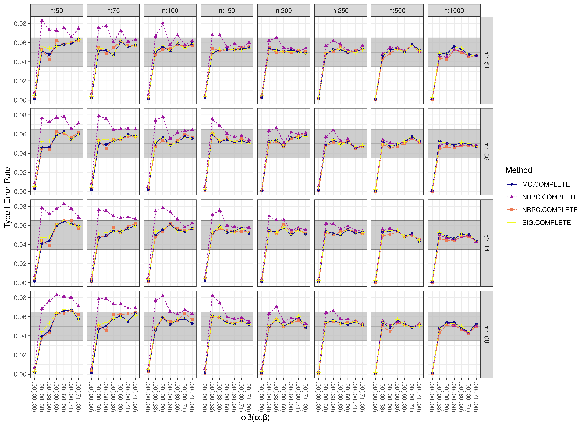
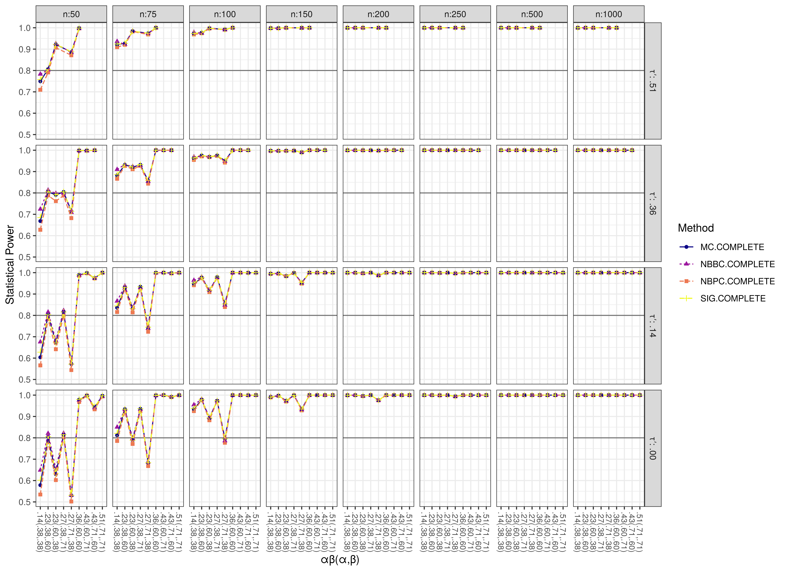
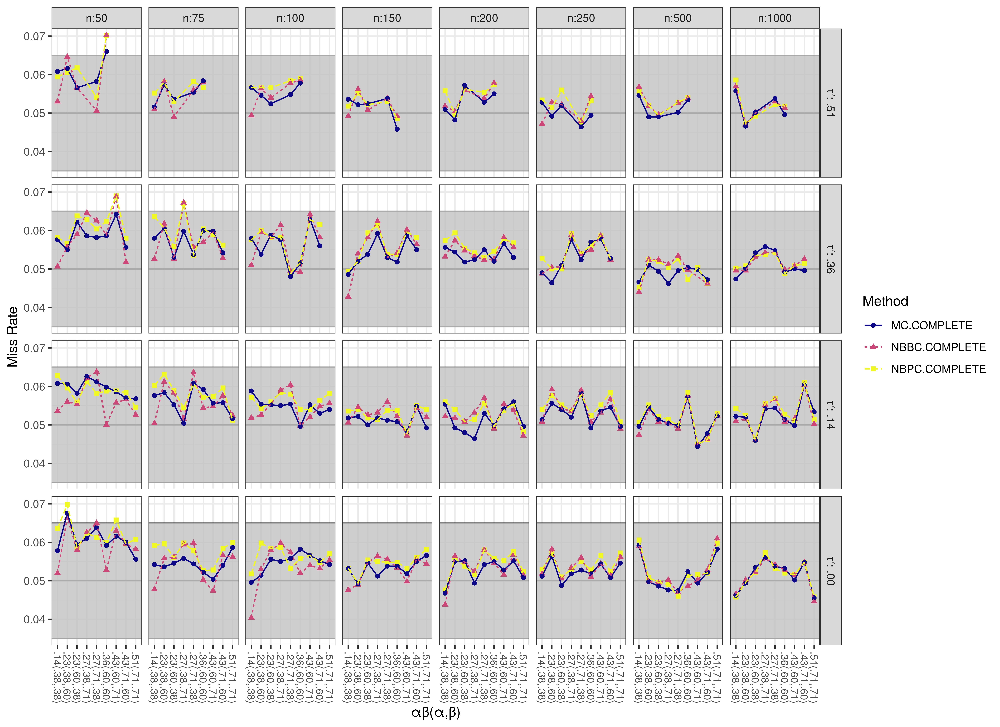
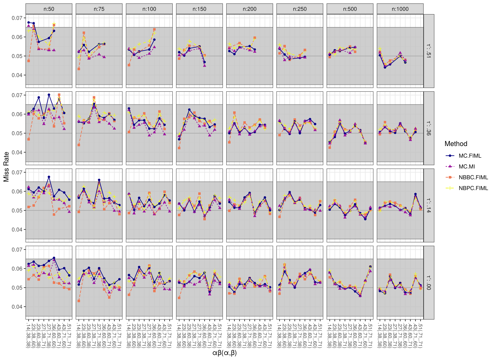

Presented below are scatter plots of Type I error rates, statistical power, and miss rates. See `FigScatterPlot()` for more details on the plots below.


```r
results_no_adj <- results
results_no_adj <- results_no_adj[
  which(
    !(
      results_no_adj$method %in% c("MC.MI.ADJ", "SIG.MI.ADJ")
    )
  )
  ,
]
results_no_adj$method <- factor(results_no_adj$method)
```

## Complete Data


### Type I Error Rate (Mechanism = COMPLETE)



### Statistical Power (Mechanism = COMPLETE)



### Miss Rate (Mechanism = COMPLETE)


## Missing Completely at Random (MCAR)


<!-- 10 Percent Missing Observations -->


### Type I Error Rate (Mechanism = MCAR, Proportion = 0.1)


### Statistical Power (Mechanism = MCAR, Proportion = 0.1)


### Miss Rate (Mechanism = MCAR, Proportion = 0.1)


<!-- 20 Percent Missing Observations -->


### Type I Error Rate (Mechanism = MCAR, Proportion = 0.2)


### Statistical Power (Mechanism = MCAR, Proportion = 0.2)


### Miss Rate (Mechanism = MCAR, Proportion = 0.2)


<!-- 30 Percent Missing Observations -->


### Type I Error Rate (Mechanism = MCAR, Proportion = 0.3)


### Statistical Power (Mechanism = MCAR, Proportion = 0.3)


### Miss Rate (Mechanism = MCAR, Proportion = 0.3)


## Missing at Random (MAR)


<!-- 10 Percent Missing Observations -->


### Type I Error Rate (Mechanism = MAR, Proportion = 0.1)


### Statistical Power (Mechanism = MAR, Proportion = 0.1)


### Miss Rate (Mechanism = MAR, Proportion = 0.1)


<!-- 20 Percent Missing Observations -->


### Type I Error Rate (Mechanism = MAR, Proportion = 0.2)


### Statistical Power (Mechanism = MAR, Proportion = 0.2)


### Miss Rate (Mechanism = MAR, Proportion = 0.2)


<!-- 30 Percent Missing Observations -->


### Type I Error Rate (Mechanism = MAR, Proportion = 0.3)


### Statistical Power (Mechanism = MAR, Proportion = 0.3)


### Miss Rate (Mechanism = MAR, Proportion = 0.3)

